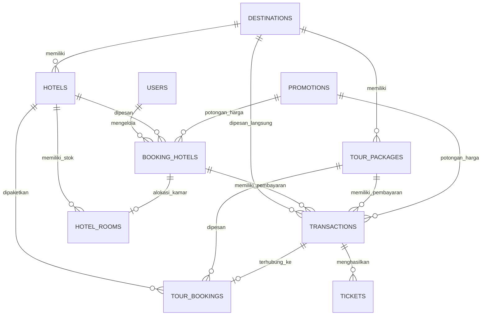

# Product Requirement Document (PRD)
## Project: Wonderful NTT – Tourism Platform

Wonderful NTT adalah platform pariwisata digital komprehensif yang dirancang untuk memperkenalkan, mempromosikan, dan mempermudah pemesanan layanan wisata di Provinsi Nusa Tenggara Timur (NTT). Platform ini dibangun menggunakan **Laravel 11**, **FilamentPHP v3**, dan **Tailwind CSS**.

---

### 1. Tujuan Platform (Product Goal)
* **Mempermudah Eksplorasi NTT**: Menyediakan direktori destinasi wisata populer dan artikel budaya NTT secara interaktif.
* **Sistem Pemesanan Terintegrasi**: Memungkinkan wisatawan memesan hotel secara real-time dan membeli paket wisata terkurasi.
* **Manajemen Tiket Elektronik**: Menyediakan sistem tiket otomatis dengan kode QR untuk verifikasi cepat oleh admin di lapangan.
* **Dasbor Administrasi Modern**: Membantu pengelola (admin) memantau inventaris kamar hotel, memesan paket tur, mencatat transaksi keuangan, dan melihat statistik pendapatan secara real-time.

---

### 2. Arsitektur & Teknologi (Tech Stack)
Platform ini dibangun dengan tumpukan teknologi modern berikut:
* **Backend Framework**: Laravel 11 (PHP 8.2+)
* **Admin Panel & CRM**: FilamentPHP v3
* **Interactive Frontend / State Management**: Laravel Livewire v3 & Alpine.js
* **CSS Framework**: Tailwind CSS
* **Build Tool**: Vite
* **Database**: MySQL / PostgreSQL
* **Integrasi Email**: Laravel Mail (untuk pengiriman kwitansi & tiket PDF/HTML)
* **Data Migration Utility**: Skrip otomasi berbasis Python untuk migrasi data massal dari file CSV ke database.

---

### 3. Struktur Basis Data (Database Schema)

Berikut adalah entitas utama dalam sistem beserta relasinya:

#### Deskripsi Model & Tabel Utama:
1. **User (`users`)**:
   * Menyimpan data kredensial admin dan staff pengelola platform.
2. **Destination (`destinations`)**:
   * Menyimpan katalog destinasi wisata di NTT.
   * Atribut penting: `name`, `location`, `price`, `rating`, `latitude`, `longitude`, `maps_url`, `status`.
3. **Hotel (`hotels`)**:
   * Menyimpan akomodasi terdaftar di NTT.
   * Inventaris kamar: Jumlah kamar dan harga dibedakan untuk tipe `single`, `double`, dan `family`.
4. **HotelRoom (`hotel_rooms`)**:
   * Melacak nomor kamar terisi dan status ketersediaan kamar (`available`, `booked`, dll.).
   * Menghasilkan nomor kamar otomatis melalui format `generateRoomNumber` (contoh: `SG-001` untuk Single Room).
5. **BookingHotel (`booking_hotels`)**:
   * Pencatatan reservasi hotel oleh customer.
   * Atribut penting: `booking_number`, `check_in_date`, `check_out_date`, `night_count`, `tax` (10%), `service_charge` (5%), `discount_amount`, `total_price`, `status` (`pending`, `approve`, `checked-out`, `failed`).
6. **TourPackage (`tour_packages`)**:
   * Paket liburan terkurasi yang mencakup durasi hari, bundling hotel, foto-foto, deskripsi, dan harga paket.
7. **TourBooking (`tour_bookings`)**:
   * Pencatatan pemesanan paket wisata oleh customer.
8. **Transaction (`transactions`)**:
   * Pencatatan finansial dari pemesanan paket wisata atau destinasi langsung.
   * Status transaksi: `pending`, `paid`, `confirmed`, `completed`, `cancelled`, `expired`.
9. **Ticket (`tickets`)**:
   * E-Ticket unik yang dihasilkan otomatis jika transaksi berstatus `paid`.
   * Format kode tiket: `TIX-[booking_code]-[Random String]`.
10. **CodePromotion (`promotions`)**:
    * Sistem kode promo diskon. Mendukung tipe diskon persentase (`discount_percent`) maupun nominal tetap (`discount_amount`).
11. **Culture (`cultures`)**:
    * Edukasi budaya lokal NTT seperti pakaian adat, tarian, makanan tradisional, dll.

---

### 4. Fitur Utama & Kebutuhan Fungsional (Core Features)

#### A. Eksplorasi Destinasi & Budaya
* **Pencarian & Filter**: Wisatawan dapat menyaring destinasi berdasarkan kategori dan lokasi kabupaten di NTT.
* **Integrasi Peta**: Integrasi titik koordinat GPS (`latitude` & `longitude`) langsung terhubung dengan Google Maps untuk navigasi instan.
* **Konten Budaya**: Artikel edukatif dengan sistem tagging dinamis untuk mengenalkan warisan leluhur NTT kepada dunia luar.

#### B. Reservasi Hotel Pintar (Smart Hotel Booking)
* **Kalkulasi Biaya Otomatis**:
  * Menghitung total biaya berdasarkan lama menginap (`night_count`).
  * Pajak tetap sebesar **10%** (`tax`) dan biaya layanan sebesar **5%** (`service_charge`).
  * Pengurangan harga langsung jika menggunakan kode promo yang valid.
* **Manajemen Inventaris Kamar Otomatis**:
  * Sistem otomatis mengurangi stok kamar hotel (`room_count_single`, `room_count_double`, `room_count_family`) ketika status booking berubah menjadi `approve`.
  * Stok kamar akan dikembalikan secara otomatis jika pesanan dibatalkan atau dirubah.

#### C. Pemesanan Paket Wisata & Sistem Tiket QR
* **Pemesanan Paket**: Memilih paket tur dan hotel terintegrasi.
* **Penerbitan Tiket Otomatis**:
  * Ketika transaksi dikonfirmasi berstatus `paid` (lunas), sistem akan membuat nomor e-ticket unik sesuai jumlah tiket yang dibeli (`number_of_tickets`).
  * E-ticket dikirimkan secara otomatis via Email (`TicketsEmail`) ke customer.
  * Tiket memiliki kode unik yang siap diverifikasi (scan QR Code) oleh petugas lapangan NTT.

#### D. Sistem Promosi & Kupon
* **Validitas Kode**: Kode promo memiliki masa berlaku dinamis (`valid_from` & `valid_until`) serta status `active` / non-aktif.
* **Verifikasi Server-Side**: Sistem mencegah manipulasi harga dengan memverifikasi kembali nilai diskon di sisi server sebelum pesanan diproses.

#### E. Dasbor Admin & Laporan Finansial (FilamentPHP)
Disediakan statistik interaktif bagi pemilik bisnis untuk menganalisis performa keuangan dan popularitas:
1. **Total Revenue Overview**: Menampilkan total pendapatan bersih, pertumbuhan omset, dan volume transaksi sukses.
2. **Monthly Transaction Chart**: Grafik garis/batang yang menganalisis tren transaksi dari bulan ke bulan.
3. **Top Tour Packages Chart**: Visualisasi statistik paket wisata terpopuler yang paling banyak dipesan.
4. **Payment Method Pie Chart**: Grafik lingkaran untuk menganalisis preferensi pembayaran wisatawan (QRIS vs Transfer Bank).
5. **Occupancy Rate Table**: Laporan tingkat keterisian kamar hotel untuk memudahkan operasional akomodasi.

---

### 5. Aturan Bisnis & Logika Validasi (Business Logic Rules)

1. **Pajak dan Layanan (Hotel Booking)**:
   $$\text{Base Cost} = \text{Room Price} \times \text{Nights}$$
   $$\text{Tax} = \text{Base Cost} \times 10\%$$
   $$\text{Service Charge} = \text{Base Cost} \times 5\%$$
   $$\text{Total Price} = \text{Base Cost} + \text{Tax} + \text{Service Charge} - \text{Discount}$$
2. **Validasi Kupon**:
   * Kupon hanya bisa digunakan jika tanggal pemesanan berada di antara `valid_from` dan `valid_until`.
   * Status kupon harus aktif (`active = true`).
3. **Pengurangan Stok Kamar**:
   * Terjadi jika booking berstatus `approve`.
   * Jika admin merubah tipe kamar pada booking berstatus `approve`, stok tipe kamar lama bertambah satu dan stok tipe kamar baru berkurang satu secara otomatis.

---

### 6. Rencana Pengujian & Validasi (Verification Plan)
* **Pengujian Fungsional**:
  * Validasi penghitungan total harga booking hotel di form dengan variasi kode promo (persen dan nominal).
  * Verifikasi e-ticket terbit dan terkirim ke email saat transaksi ditandai `paid`.
  * Memastikan sisa kamar hotel berkurang/bertambah secara akurat saat status reservasi berubah di admin panel.
* **Pengujian Admin Panel**:
  * Memastikan widget grafik dan data tabel pada dashboard admin memproses kalkulasi finansial dengan benar.
